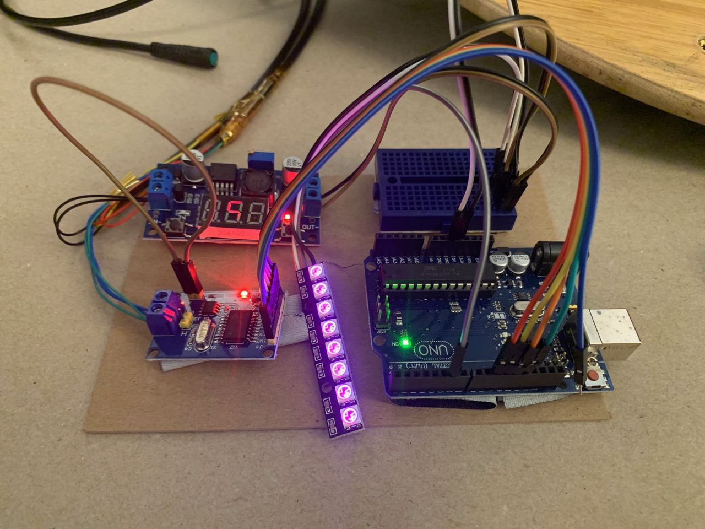
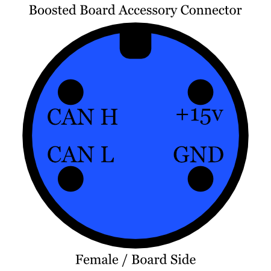
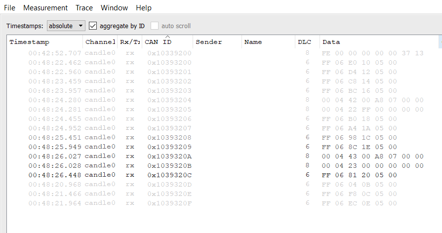

# Accessories

The Boosted Board has two accessory connectors at the front and back of the board. The ESC needs firmware V2.7.2 to enable communication and provide power, and without the accessory registering, the board will cut power after 5 seconds.

## Proof of Concept
I wrote a Beams Proof of Concept as an Arduino Sketch, available as [beams_emulator.ino](beams_emulator.ino) in this directory. The code is set up to work on an Arduino Uno, with a MCP2515 CAN transceiver board, and 8 WS2812B ("Neopixel") LEDs to act as a headlight, powered by the board through a buck regulator. To see a video demo, see [this Tweet](https://twitter.com/robertscullin/status/1251745762888822785).




## Physical Connectivity
The board has two 4 pin connectors commonly used with eBikes, sometimes called "[Julet 4 pin](https://www.aliexpress.com/item/33026946546.html)" (but _not_ the Julet Mini) or "[BAFANG 4 pin](https://www.amazon.com/BAFANG-Female-Extension-Throttle-Sensor/dp/B07NV6THFD/)" cables. The connector carries a CAN pair, switched +15v, and ground.



## Protocol
The Accessory connector, like the BMS<->ESC communication, uses a CAN bus to communicate at 250kbaud, with extended IDs. An accessory has to register itself with the ESC within the first 10 seconds to keep the +15v rail active. Once any accessory registers itself with the ESC, the +15v rail will stay on until the board shuts down.

The ESC will continuously send an increasing counter value to the IDs in the range of `0x1039320N` -- every half a second, a new timestamp will be sent to N+1, until it wraps back around to 0.

To register as the Front Beams, send (hex) `[FE 00 00 00 00 00 37 13]` to `0x10339200`.

```
0xFE; // Accessory Init / Registration
0x00;
0x00;
0x00;
0x00;
0x00; // 00 is Headlights, 01 is Taillights
0x37; // Serial, LSB
0x13; // Serial, MSB
```

Once registered, the ESC will send events based on what has been registered -- if you only register headlights, it won't send brake light commands.

Possibly the easiest way to understand this is with a screen capture of [cangaroo](https://github.com/HubertD/cangaroo), a CAN capture program. The capture shows the headlight initialization at `0x10339200`, and the rolling messages sent every half second with the IDs `0x1039320X`. Additionally the Beams were turned on (`0x10393204` and `0x10393205`) and off (`0x1039320B` and `0x1039320C`). The command messages can appear anywhere in the ID range, and parsing the first byte of the messages as well as the length seems to be the best way to parse the message.




## Power
The Accessory port provides +15v for the first 5 seconds of board power on without an accessory registering, and will continuously provide power if any accessory registers.

The official Beams have a USB-C port for charging accessories, and is rated for 5v 3A. Not pulling more than 15W from the Accessory connectors, combined, seems like a safe limit.
